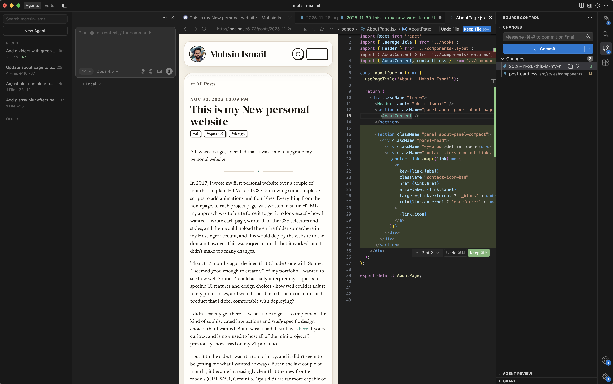

A few weeks ago, I decided that it was time to upgrade my personal website.

---

In 2017, I wrote my first personal website over a couple of months  - in plain HTML and CSS, borrowing some simple JS scripts to add animations and flourishes. Everything from the homepage, to each project page, was written in static HTML - my approach was to brute force it to get it to look exactly how I wanted. I wrote each page, wrote all of the CSS selectors and styles, and then would upload the entire folder somewhere in my Hostinger account, and this would deploy the website to the domain I owned. This was **super** manual - but it worked, and I didn't make too many changes.

Then, 6-7 months ago I decided that Claude Code with Sonnet 4 seemed good enough to create v2 of my portfolio. I wanted to see how well Sonnet 4 could actually interpret my requests for specific UI features and design choices - how well could it adjust to my preferences, and would I be able to hone in on a finished product that I'd feel comfortable with deploying?

I didn't exactly get there - I wasn't able to get it to implement the kind of sophisticated interactions and *really* specific design choices that I wanted. But it wasn't bad! It still lives [here](https://mhismail3.github.io/personal-website-v2/) if you're curious, and is now used to host all of the mini projects I previously showcased on my v1 portfolio.

I put it to the side. It wasn't a top priority, and it didn't seem to be getting me what I wanted anyways. But in the last couple of months, it became increasingly clear that the new frontier models (GPT 5/5.1 and Gemini 3) are far more capable of being steered, and delivering output of far higher quality and complexity. So I decided that the last attempt was now v1.5, and that I'd start on a new v2.

Over the last week or so, I used Cursor to go back and forth with these models over many chats and get a sense of what each's strengths and weaknesses were as I developed the website and various features. I found that GPT 5.1, specifically `GPT-5.1-Codex-Max`, was really good at figuring out the solutions to the problem at hand, even if it was complex or obscure. But it sucked as a UI designer. Gemini 3 Pro, on the other hand, was a *great* UI designer and was able to implement most things that I asked for, but in terms of fixing bugs or edge cases in interactions, it failed often.

Jumping back-and-forth between these two models, switching chats when one wasn't delivering in the way that I wanted - this worked pretty well for a couple of days.

Then, Opus 4.5 came out - and **this** model really helped speed everything up. Ever since Opus 4.5, it's been the model I just "stick" with because it's easier. 

It has the same thoroughness of GPT 5.1 in terms of diving deep into complex issues and solving all kinds of problems that I'd throw at it (I'd often just type in a really specific and intricate issue that I was observing and ask it to "robustly" address it, I'd let it sit for 10-15 minutes, and I'd come back and the issue was fixed - with no follow-up needed).

It **also** has the design sensibilities of Gemini 3, and would just *get* what I would be asking it to design. Twice, at various points of development where things were relatively stable, I asked Opus 4.5 to just completely refactor and clean everything up to make it more maintainable and extensible, while, critically, not changing anything about how the site worked at the time. It handled the requests with no issue at all. The second time I did this, I asked it to take the opportunity to implement a dark mode while it did the refactoring. I came back 10 minutes later to a dark mode implementation that was well-thought out, and essentially 95% completed. A few more back and forth edge case fixes and changes, and it was done within the day.

Using Opus 4.5, I spent the last few days implementing the remaining features I had thought out, and put the final touches on the site - and I'm really happy with how it turned out. I like focusing on all of the little design details and making sure everything's cohesive, and vibecoding with Opus made this far more possible than I thought.

As frontier models improve and become increasingly more capable software developers, maybe the important thing (at least for a couple of years) will be the ability to steer agents, have *taste* in design, and build something that stands out. If AI can design 98% of the entire product, that 2% that makes a product stand out will become the difference-maker. 

Hope you enjoy checking out the website!