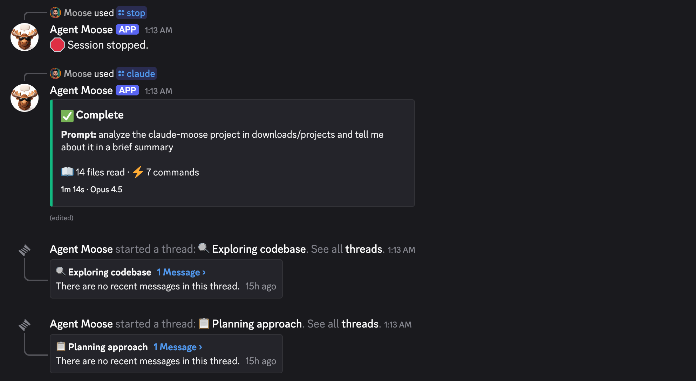

I spent the last couple of days attempting to build a way to access Claude Code remotely from my phone. The idea: text Claude, have it work on my codebase, and see the results stream back—with persistent access to my Mac Mini's file system and whatever apps I have running at home. I called it [Claude Moose](https://github.com/mhismail3/claude-moose).

It's not working yet, but I wanted to share what I learned so far.

---

I started with Telegram since the bot API is straightforward. The goal was simple: stream Claude Code's terminal output as replies in a Telegram chat. I got a persistent process running on my Mac Mini and could initiate sessions through the bot, but quickly hit roadblocks—Telegram wasn't reliably sending input back to the session when Claude requested user confirmation.

So I pivoted to Discord^[I asked Claude what are the best platforms for this type of messaging and evaluated a few of the options - Discord stood out] and had Opus 4.5 rewrite the implementation in Python. The same core issues followed me: misformatted terminal output, the bot failing to recognize inputs, sessions hanging unexpectedly.

The underlying problem was trying to wrangle raw CLI output through a messaging layer. I switched to the Agent SDK hoping for a more robust approach to message parsing and I/O handling. This got me *nearly* there—until I ran out of API credits and realized my Claude Max plan wasn't going to cover it 🥲. The Agent SDK bills through the API, not your subscription. I wanted remote Claude access *within* what I'm already paying for, not a parallel expense.

---

I'm now having Opus rewrite everything to be purely CLI-based, using Tmux for session management. Still a work in progress.

In the meantime, if I need remote Claude access, the practical path is just SSH into a machine running Claude Code. Less elegant than a Discord bot, but it uses what I'm already paying for.

I pushed everything to [GitHub](https://github.com/mhismail3/claude-moose) if you want to take a look!